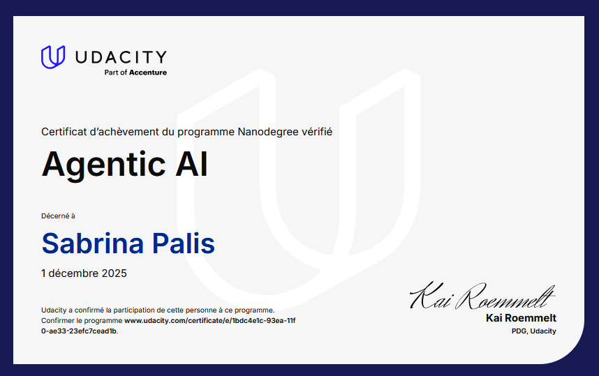

<div align="center">

# 🤖 Agentic AI Early Projects Portfolio

### Planning Systems • Multi-Agent Architectures • RAG • Memory • Workflow Automation

*MSc Artificial Intelligence (First Class Honours)*

<br>


</div>

---

## Overview

This repository gathers four projects completed during the **Udacity Agentic AI Nanodegree**.

Together, they explore a progression of increasingly sophisticated AI systems:

* Planning agents
* ReAct workflows
* Multi-agent architectures
* Retrieval-Augmented Generation (RAG)
* Long-term memory systems
* Business process automation
* Agent orchestration

While educational in origin, these projects provided hands-on experience with many of the architectural patterns that underpin modern AI assistants, agentic workflows, enterprise copilots, and autonomous decision-support systems.

---

## Learning Journey

The portfolio follows a natural progression from single-agent planning systems toward increasingly capable multi-agent environments.

```text
Project 1
Planning + ReAct
        ↓

Project 2
Multi-Agent Orchestration
        ↓

Project 3
RAG + Research Agents + Memory
        ↓

Project 4
Business Operations Multi-Agent System
```

---

# Portfolio Projects

---

## ✈️ Project 1 — AgentsVille Trip Planner

### Agentic Travel Planning with Structured Outputs and ReAct Agents

The first project focuses on itinerary generation using structured outputs and tool-assisted reasoning.

Key concepts:

* Prompt Engineering
* Pydantic Validation
* Structured JSON Outputs
* ReAct Workflows
* Tool Use
* Iterative Planning

**Highlights**

* Generates complete travel itineraries
* Produces validated structured outputs
* Uses reasoning and tool-calling cycles
* Revises plans based on user requests

📁 Folder: `01-agentsville-trip-planner`

---

## 🤖 Project 2 — AI-Powered Agentic Workflow for Project Management

### Multi-Agent Planning and Workflow Orchestration

This project explores how specialized AI agents can collaborate to transform a product specification into a structured development plan.

Key concepts:

* Agent Orchestration
* Task Routing
* Evaluation Loops
* Workflow Decomposition
* Team-Based Agent Design

**Highlights**

* Action Planning Agent
* Routing Agent
* Product Manager Agent
* Program Manager Agent
* Development Engineer Agent
* Evaluation Agents

📁 Folder: `02-agentic-project-management-workflow`

---

## 🎮 Project 3 — UdaPlay Research Agent

### Retrieval-Augmented Generation and Memory Systems

This project introduces retrieval-based AI systems capable of combining internal knowledge, web search, and long-term memory.

Key concepts:

* Retrieval-Augmented Generation (RAG)
* ChromaDB
* Semantic Search
* Web Search
* Stateful Agents
* Memory Architectures

**Highlights**

* Searches local vector database
* Evaluates retrieval quality
* Falls back to web search
* Persists new information
* Produces cited responses

📁 Folder: `03-udaplay-research-agent`

---

## 🏭 Project 4 — Beaver's Choice Multi-Agent Operations System

### Business Automation Through Agent Collaboration

The final project demonstrates a production-style multi-agent workflow supporting operational business processes.

Key concepts:

* Multi-Agent Systems
* Inventory Management
* Sales Automation
* Procurement Support
* Database Integration
* Business Process Automation

**Highlights**

* Inventory Agent
* Quote Generation Agent
* Sales Agent
* Procurement Agent
* Central Orchestrator
* SQLite Integration

📁 Folder: `04-beavers-choice-multi-agent-system`

---

# Skills Demonstrated

### Agentic AI

* Agent Design
* ReAct Frameworks
* Multi-Agent Systems
* Agent Routing
* Agent Evaluation

### Retrieval Systems

* Vector Databases
* Semantic Search
* Retrieval-Augmented Generation
* Memory Architectures

### AI Engineering

* Prompt Engineering
* Workflow Orchestration
* Tool Calling
* Structured Outputs
* State Management

### Software Engineering

* Python
* SQLite
* Pydantic
* Modular Design
* Workflow Automation

---

# Technologies

| Category                | Technologies         |
| ----------------------- | -------------------- |
| Programming             | Python               |
| LLMs                    | OpenAI Models        |
| Retrieval               | ChromaDB             |
| Validation              | Pydantic             |
| Databases               | SQLite               |
| Agent Frameworks        | Agentic AI Workflows |
| Development Environment | Jupyter Notebook     |

---

# Reflections

One of the most valuable aspects of this portfolio was observing how agentic systems evolve as additional capabilities are introduced.

The progression from:

* planning,
* to coordination,
* to retrieval,
* to memory,
* to business operations,

highlights how modern AI applications increasingly rely on systems of interacting components rather than standalone prompts.

These projects provided a practical introduction to the architectural ideas currently shaping AI assistants, enterprise copilots, workflow automation systems, and multi-agent platforms.

---

# Certificate

This repository accompanies my completion of the **Udacity Agentic AI Nanodegree**, focused on practical applications of agentic workflows, retrieval systems, multi-agent architectures, and AI-powered automation.



---

## Author

### S. Palis

**AI Systems • Applied AI Education • Computational Research**

Exploring agentic workflows, retrieval systems, scientific discovery tools, multi-agent architectures, and human-centered AI systems.

GitHub: https://github.com/MinervaRose

LinkedIn: https://www.linkedin.com/in/sabrina-jp/

</div>
